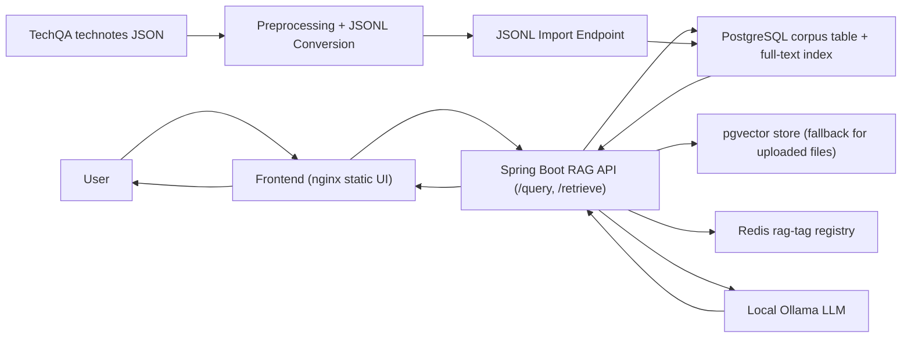

```mermaid
flowchart LR
    U["User"] --> F["Frontend (nginx static UI)"]
    F --> B["Spring Boot RAG API (/query, /retrieve)"]
    B --> DB["PostgreSQL corpus table + full-text index"]
    B --> V["pgvector store (fallback for uploaded files)"]
    B --> R["Redis rag-tag registry"]
    B --> O["Local Ollama LLM"]
    D["TechQA technotes JSON"] --> P["Preprocessing + JSONL Conversion"]
    P --> I["JSONL Import Endpoint"]
    I --> DB
    DB --> B
    O --> B
    B --> F
    F --> U
```
